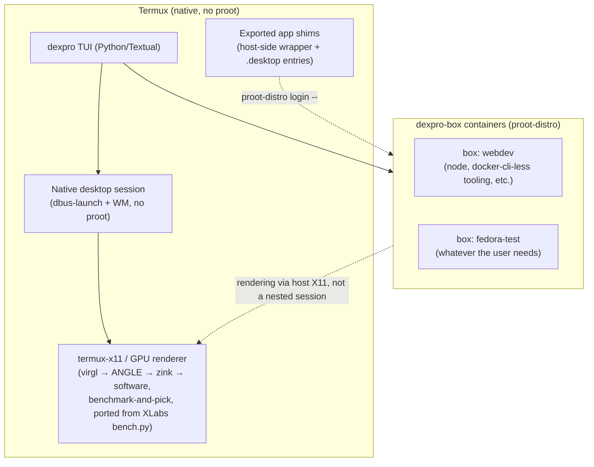

# Dexpro — Product Requirements Document

**Turn your DeX into a professional setup.**

Status: Draft v1
Date: 2026-08-25
Command: `dexpro`
Stack: Python + [Textual](https://github.com/Textualize/textual)
Repo: `D:\dexpro` (new, empty at time of writing)
References (read-only, not forked): `D:\XLabs`, `D:\dextop`

---

## 1. Problem Statement

Dexpro's author is a web developer who runs a full Linux desktop on Android via [XLabs](https://github.com/arinadi/XLabs) (Debian 13 + XFCE inside `proot-distro`, driven by a Textual TUI). It works well on the phone alone, but degrades badly when docked into **Samsung DeX** at home — worse than running native Android apps, and worse than RDP-ing into an office PC from the same phone. On the go (no DeX, smaller session, lighter workload) it feels fine.

### Root cause (confirmed from code, not assumed)

XLabs is **100% proot-contained**: `installer/system.py::container_command()` always routes through `proot-distro login ... --shared-tmp`, and `installer/start.py::start_xfce4()` launches `xfce4-session` itself inside that proot'd shell. There is no code path anywhere in XLabs that runs a GUI session natively under Termux.

`proot` intercepts every syscall via `ptrace`. That overhead is roughly constant *per syscall*, not per pixel — so it barely shows up on light, mobile-scale usage, but scales up sharply with a DeX-sized session: bigger window server traffic, a full compositor, multiple windows, more input/event syscalls. That matches the reported symptom exactly: fine on mobile, bad on DeX.

A second, independent data point: [dextop](https://github.com/nathaneltitane/dextop) already ships **two different session paths** in `container-session`:
- **Native** (`container_session()`, green prompt): runs `dbus-launch --exit-with-session xfce4-session` **directly under Termux — no proot at all.**
- **Container** (`container_intent()`, fuschia prompt): hand-rolls its own raw `proot` invocation (`--rootfs`, `--change-id`, manual `--bind` mounts) — notably, *not* built on `proot-distro`.

Both paths use the same Termux-side display server (`termux-x11` or `Xvfb`+`x11vnc`) and the same GPU renderer (`virgl_test_server_android`) — the difference is purely whether the **session/application process itself** is proot'd. This is direct evidence that a native session is both possible and the lower-overhead path.

### Goal

Get XLabs-grade polish (Doctor, Store, Backup, Bench, Settings) with dextop-grade session performance, by **not running the desktop environment inside proot at all**, and reserving `proot-distro` for what it's actually good at: isolated, disposable dev/CLI environments — a distrobox-style helper, not a desktop host.

---

## 2. Goals / Non-Goals

### Goals

- G1: XFCE (or a lighter alternative, see [§7.1](#71-native-wm-choice)) desktop session runs natively under Termux, with no proot in the GUI critical path.
- G2: A `proot-distro`-backed, distrobox-style container helper (`dexpro-box`) for isolated per-project/per-toolchain environments — create, enter, remove, manage users and packages, export apps to the host.
- G3: One `dexpro` command, one Textual TUI, covering both layers.
- G4: Feature parity with XLabs' operational tooling (Doctor, Bench, Backup, Settings) — re-scoped to work across the native layer *and* however many `dexpro-box` containers exist, not just one Debian container.
- G5: Feature parity with dextop's Android-integration tooling (storage auto-linking, mimetype/activity bridging to native apps) where it doesn't conflict with G1.
- G6: Measurable, on-device fix for the DeX performance complaint (see [§4 Success Metrics](#4-success-metrics)).

### Non-Goals (v1)

- NG1: Root access / kernel-level changes (Android Phantom Process Killer workaround stays a documented manual step, as in XLabs today).
- NG2: Docker/Podman support — same Android kernel limitation XLabs already documents; out of scope regardless of architecture.
- NG3: Windows/iOS/desktop-OS support — Android + Termux only.
- NG4: Full distro parity with upstream `proot-distro` on day one — v1 targets whatever short list ships first (see [§7.3](#73-container-distro-scope)); broader distro support is additive, not blocking.
- NG5: Migrating existing XLabs or dextop installs automatically — dexpro is a fresh install target in v1, not an upgrade path.

---

## 3. Users

Single primary persona: the author — a web developer who wants their phone to be a docked professional dev workstation at home (DeX) and a lighter mobile setup on the go, without maintaining two different tools. Not designed as a general public-release product in v1, but written cleanly enough that it could become one later (same bet XLabs made).

---

## 4. Success Metrics

- **Perceived responsiveness**: window drag/resize, XFCE panel interaction, and terminal scroll on DeX feel comparable to native Android apps — no more RDP-to-office being the faster option for local work.
- **Quantified**: `glmark2` and a syscall-volume proxy (e.g. `strace -c` sample of a normal session, or wall-clock of a fixed panel/window-manager stress script) native-session vs XLabs-style full-proot session, on the same device, same DeX dock. Target: native session shows meaningfully lower overhead — exact threshold TBD once a baseline measurement exists (this PRD doesn't fabricate a number XLabs/dextop never measured).
- **Container helper**: creating a new `dexpro-box` container, adding a user, and exporting one app to the host launcher completes without manual shell intervention.

---

## 5. Architecture

### 5.1 Native layer

- Desktop session (window manager + panel + compositor-off, following XLabs' own performance rationale for disabling compositing) launched directly under Termux via `dbus-launch`, mirroring dextop's proven `container_session()` pattern — but re-implemented in Python/Textual rather than bash, and integrated with XLabs' benchmark-driven renderer selection (`bench.py`: virgl → ANGLE → zink → software, whichever wins on-device) instead of dextop's fixed virgl-first assumption.
- `termux-x11` remains the display server (X11 default; VNC as a documented fallback per dextop's model, not the primary path).
- No `proot-distro login` anywhere in this layer's start/stop lifecycle.

### 5.2 `dexpro-box` layer (distrobox-style helper)

Built **on top of `proot-distro`** (mature, actively maintained, broad distro support) rather than reinventing rootfs extraction the way dextop's `container-image` does (manual `tar.xz` pulls from `get.trmnl.me`, Debian/Ubuntu only). `proot-distro` already solves image acquisition; `dexpro-box` adds the distrobox-shaped UX and lifecycle management on top:

| Capability | Behavior |
|---|---|
| `dexpro box create <name> [--distro X]` | `proot-distro install` under the hood, then runs `dexpro-box`'s own first-boot user setup |
| `dexpro box enter <name>` | Login shell into the container (`proot-distro login`) |
| `dexpro box user add <name>` | Creates a container user **mapped to the actual host UID/GID** — fixing dextop's hardcoded `1000:1000` gap found in its automated `container-user` path |
| `dexpro box pkg <search\|install> <name>` | Store-equivalent, scoped to the target container |
| `dexpro box export <name> <bin>` | Generates a host-side wrapper script + `.desktop` entry that runs `proot-distro login <name> -- <bin>` — **new work**; neither XLabs nor dextop has an app-export mechanism today |
| `dexpro box list / remove` | Lifecycle management |

Containers are for isolated CLI/dev tooling and specific apps exported individually — **not** for hosting an entire desktop session. That distinction is the actual fix for the reported perf problem.

### 5.3 `dexpro` TUI

Python + Textual, structurally modeled on XLabs' screen set, re-scoped to operate across the native layer and N containers instead of one:

| XLabs screen | dexpro equivalent | Change |
|---|---|---|
| Start/Stop Desktop | Start/Stop (native session) | No proot step; reuses XLabs' audio → GPU → X11 → session chain, minus the proot login step |
| Store | `dexpro box pkg` (per-container) | Same UX, now needs a container selector |
| Doctor | Doctor (native + per-container) | Native-layer checks (X11 socket, GPU renderer, audio) stay; proot-specific checks (Electron `--no-sandbox` patch, container package manager) become per-`dexpro-box` |
| Backup | Backup (native home + per-container) | Same `tar`-inside-target approach XLabs uses, run once for the native home, optionally once per container |
| Bench | Bench (native layer only) | Directly reusable pattern — GPU preset benchmarking has nothing proot-specific about it |
| Settings | Settings (native + per-container) | Per-device overrides stay; container-specific settings become scoped |
| — (new) | Box manager | Create/enter/list/remove/export, per §5.2 |

---

## 6. Feature Parity Matrix

| Feature | Source | Status in dexpro v1 |
|---|---|---|
| Native desktop session (no proot) | dextop pattern, Python reimplementation | New implementation, Phase 1 |
| Benchmark-driven GPU renderer selection | XLabs `bench.py` | Ported (pattern, not code) |
| Benchmark-driven bind-mount/isolation profile | XLabs `isolation.py`/`iobench.py` | Applies to `dexpro-box` containers, Phase 2 |
| Electron `--no-sandbox` patching | XLabs `electron.py` | Ported, scoped per-container |
| Doctor diagnostics | XLabs `doctor.py` | Re-scoped, Phase 4 |
| Backup/restore | XLabs `backup.py` | Re-scoped, Phase 4 |
| Package store/search | XLabs `packages.py` | Re-scoped per-container, Phase 2/5 |
| Storage auto-linking (SD card, `/storage` detection) | dextop `termux-storage` | Ported, Phase 5 |
| Mimetype/activity bridging to native Android apps | dextop `dextop-additions` | Ported, Phase 5 |
| VNC fallback display server | dextop `container-session -o vnc` | Ported as fallback, Phase 1 |
| Container image acquisition | `proot-distro` (upstream) | Replaces both XLabs' and dextop's own approaches |
| Per-container user creation, host-UID-mapped | New (fixes dextop gap) | Phase 2 |
| App export to host launcher | New (neither project has this) | Phase 3 |

---

## 7. Open Questions / Risks

### 7.1 Native WM choice

XFCE is the safe default (matches both reference projects, known-working). But since the whole point of the native layer is minimizing syscall volume, a lighter WM (i3, as dextop already optionally supports) may be worth benchmarking against XFCE on-device before committing — using the same "measure, don't guess" approach XLabs already applies to GPU renderer choice. **Decision deferred to Phase 1 implementation, not this PRD.**

### 7.2 Compositing

XLabs disables XFCE compositing for performance reasons already; dextop's README states the same recommendation independently. Native layer should default to compositing off.

### 7.3 Container distro scope

`proot-distro` upstream supports more than dextop's manual Debian/Ubuntu-only list. v1 scope (which distros ship as one-command `dexpro box create`) is an implementation decision, not fixed here — default to whatever `proot-distro` itself lists, no dexpro-side whitelist unless a specific distro proves broken.

### 7.4 Phantom Process Killer

A native background desktop session is more exposed to Android's Phantom Process Killer than a foreground-only proot session might have been. Needs the same documented manual workaround XLabs already ships (Developer Options toggle / `adb shell settings put ...`), possibly promoted to a Doctor check.

### 7.5 App export fidelity

Exporting a container's binary to run under the *native* X11 session (rather than a nested container display) means the exported app still crosses the proot/ptrace boundary for its own syscalls — it just avoids nesting a whole second desktop session. This narrows the perf gap for exported apps but doesn't eliminate it the way the native WM/session itself does. Should be documented as a known tradeoff, not oversold.

### 7.6 Migration

No auto-migration from existing XLabs/dextop installs in v1 (NG5). Whether that's acceptable long-term is an open question, not resolved here.

---

## 8. Phased Milestones

1. **Phase 1 — Native session**: `dexpro` boots a native XFCE (or chosen WM) session under Termux, no proot, with benchmark-driven GPU renderer selection. This alone directly addresses the reported DeX performance complaint.
2. **Phase 2 — `dexpro-box` core**: create/enter/list/remove containers on `proot-distro`, host-UID-mapped user creation, package search/install.
3. **Phase 3 — App export**: wrapper + `.desktop` generation so a container's app is launchable from the host, rendered via the native X11 session.
4. **Phase 4 — Doctor/Backup/Bench parity**: re-scoped across native layer + all `dexpro-box` containers.
5. **Phase 5 — Android integration polish**: storage auto-linking, mimetype/activity bridging, Settings screen, Store UX refinement.

---

## 9. Explicitly Not Reused As-Is

Per the "fresh rewrite" decision: no code is forked from either XLabs or dextop. Patterns and lessons are reused (benchmark-driven decisions, native-session lifecycle shape, `.env`-style per-device settings); implementation is new, in Python/Textual, unified under the `dexpro-box` abstraction that doesn't exist in either source project.

---

## 10. Addendum — corrections from deeper research (2026-08-25)

Findings below came out of the per-phase build-task research pass (see `build-task-phase1.md`–`phase5.md`) and correct or sharpen claims made earlier in this document. Not a rewrite — the architecture in §5 stands.

- **`proot-distro` is now a Python/Docker-OCI tool (v5.x, current v5.8.0), not the old bash/fixed-distro-list tool.** It already ships `install <image>` (any Docker ref), `list`, `remove`, `rename`, `search`, `backup -c {gzip,bzip2,xz,zstd,none}`, `restore`, `reset`. This means §5.2's "distrobox-shaped UX on top of proot-distro" is a thinner layer than originally scoped — most container lifecycle is already there upstream. What's still genuinely missing (and stays dexpro's actual new work): **host-UID/GID-mapped real user creation** (proot-distro's `--user` flag is ptrace UID-faking via `--change-id`, not a real container account), a **package-management convenience wrapper**, and **app export** (§5.2/§8 Phase 3 — confirmed neither `proot-distro` nor either reference project has this).
- **dextop's native/container session split is not two alternate GUI implementations** — corrected from §1's framing. There is exactly one GUI-launch code path (`dbus-launch --exit-with-session ${session}`, zero proot references); it just runs in two different ambient shell contexts (bare Termux, or already inside a proot'd interactive shell). Doesn't change dexpro's own architecture, but the "two proven paths" framing in §1 overstated what dextop demonstrates — the proof is simply "a full GUI session works with zero proot," not "dextop has two independent GUI stacks."
- **GPU acceleration on Mali/Exynos devices has no zink or Turnip-equivalent path today** (both are Adreno-only per current termux-x11 hardware-acceleration docs) — Mali devices are still virgl/software-fallback only. This directly matters for Samsung DeX devices on Exynos SoCs and narrows §7.1's "measure, don't guess" renderer bench to a smaller candidate set on those devices. Device GPU vendor must be identified before assuming zink/Turnip are even candidates — see Phase 1 spike list.
- **DeX-docked-state auto-detection from a plain Termux shell has no confirmed method** (documented APIs are Java/app-level: `UiModeManager`, Samsung Knox broadcasts, requiring a registered app component). This PRD does not commit to auto-switching behavior when docked vs mobile as a v1 feature — it's an open spike (§7 risk), not a stated goal, until on-device verification says otherwise.
- **`termux-wake-lock` requires no Termux:API app** (ships in core `termux-tools`) and **is strictly necessary** — Termux's foreground service alone prevents low-memory kill but does not itself hold a CPU wakelock; confirmed from `TermuxService.java` that the wakelock is only acquired on explicit `ACTION_WAKE_LOCK`/`termux-wake-lock` call. XLabs already does this correctly (`start.py::acquire_wake_lock()`); carry it forward as-is in Phase 1.
